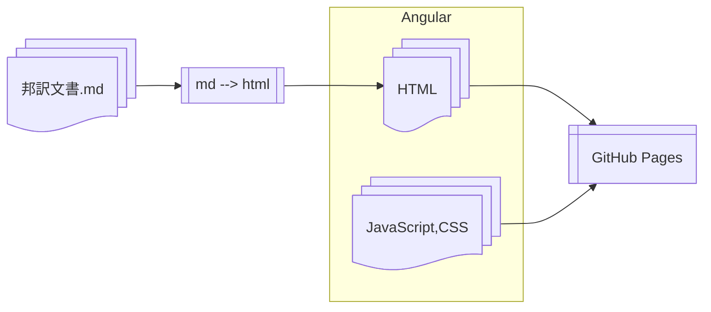

# オンライン版(Webアプリ)の作成

ここでは、邦訳文書を元にHTML文書を作成し、それをWebアプリとして[GitHub Pages](https://jpdga-shizuoka.github.io/rules)に公開するまでを行います。

## 参照

* [Angular](https://angular.dev) - Webアプリプラットフォーム
* [markdown-it](https://github.com/markdown-it/markdown-it) - MDからHTMLへの文書変換
* [angular-cli-ghpages](https://github.com/angular-schule/angular-cli-ghpages) - AngularアプリをGitHub Pagesに公開する
