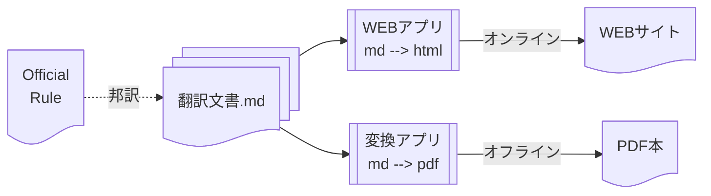

# ディスクゴルフ公式規則の邦訳

ここはPDGAの[Official Rules of Disc Golf](https://www.pdga.com/rules/official-rules-disc-golf)を翻訳しそれを公開するためのプロジェクトです。

以下の作成を目標にしています:
1. 翻訳文書の作成、
1. [オンライン版(Webアプリ)の作成](README.APP.md)、
1. [オフライン版(PDF本版)の作成](pandoc/README.md)。

なお、本プロジェクトを含む一連のプロジェクトによる成果は、
[ディスクゴルフの公式規則と競技マニュアル](https://jpdga-shizuoka.github.io/documents/)
で参照できます。

## 翻訳文書の作成

翻訳された文書を下表の通り配置しました。

| ディレクトリ           |　用途
|----------------------|---
| [rules](rules)       | 公式規則 本文
| [appendix](appendix) | 公式規則 附則
| [qas](qas)           | 公式規則 Q&A

## Copyrights

The original copyrights under [rules](rules), [appendix](appendix) and [qas](qas) are reserved by PDGA.
