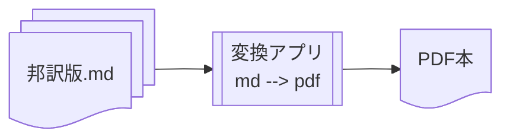

# PDF本の作成

ここでは、競技マニュアルの邦訳版を元に、PDF本を作成します。



## 変換アプリ

マークダウンファイルからPDF本を作成するための変換アプリとして、
[Pandoc](https://ja.wikipedia.org/wiki/Pandoc)を利用しました。


### 準備

Pandocの実行環境を容易に構築できる様に、
[Docker](https://www.docker.com)による仮想環境を作りました。
先ずは以下の手順で、Dockerの実行環境を用意します:

1. [Dockerのインストール](https://docs.docker.com/engine/install/)。
1. 実行用dockerイメージを作成する。
    1. `docker pull pandoc/latex:latest-ubuntu`
    1. `docker build -t pandoc .`

    > 補足: イメージベースとして`pandoc/latex:latest-ubuntu`を指定しているのは、
    arm64版を使いたいため(だけ)です。
    その制約がなければ`pandoc/latex`でも良いですが、
    その際は多少`Dockerfile`を書き換える必要があります。

### 実行

ホストOS上で、`makedoc`を実行します。

```sh
cd pandoc
./makedoc [all|clean]
```

成功すると[ディスクゴルフ大会のための競技マニュアル.pdf](ディスクゴルフ大会のための競技マニュアル.pdf)ファイルが作成されます。


## 版の更新

原文が更新され新しい版のPDF本を作成する際は、以下を適宜変更します:

* [config/revisions.yaml](config/revisions.yaml)

* [sources/preface.md](sources/preface.md)

### デバッグ

* 下記の通りターゲットOS上で`bash`を立ち上げると便利です。
なお、PandocのカスタムフィルターにPythonを利用している関係で、
一度`/home/venv/bin/activate`を読み込んで、Pythonの実行環境を設定します。

    ```sh
    docker run --rm --entrypoint="bash" -v $(pwd):/data -v $(pwd)/../cm:/source -it pandoc
    source /home/venv/bin/activate # Python実行環境の設定
    make [all|clean] 等
    ```

* Pandocのフィルターを作成するには、
先ずPandocがどのようにマークダウンファイルを分析しているか知ることが重要で、
[print-all.py](filters/print-all.py)は大いに役立ちました。

    ```sh
    e.g. pandoc --filter filters/print-all.py -o foo.pdf testdata/foo.md
    ```

# 参照

* [Pandoc User's Guide](https://pandoc.org/MANUAL.html)
* [Panflute User's Guide](https://scorreia.com/software/panflute/guide.html) - Pandocカスタムフィルター用Pythonライブラリ

Pandocの環境作りは、以下を参考にしました:

* [楽にDockerで日本語Pandocする](https://qiita.com/kojix2/items/1d2db46858ce202628d2)
* [自分が普段使ってるpandocの設定ファイルをさらす](https://zenn.dev/t4aru/articles/d6e23e4407c605)
* [Pandocのテンプレート機能でYAMLから本の奥付を自動生成する](https://qiita.com/sky_y/items/47da01623f50380c2023)
