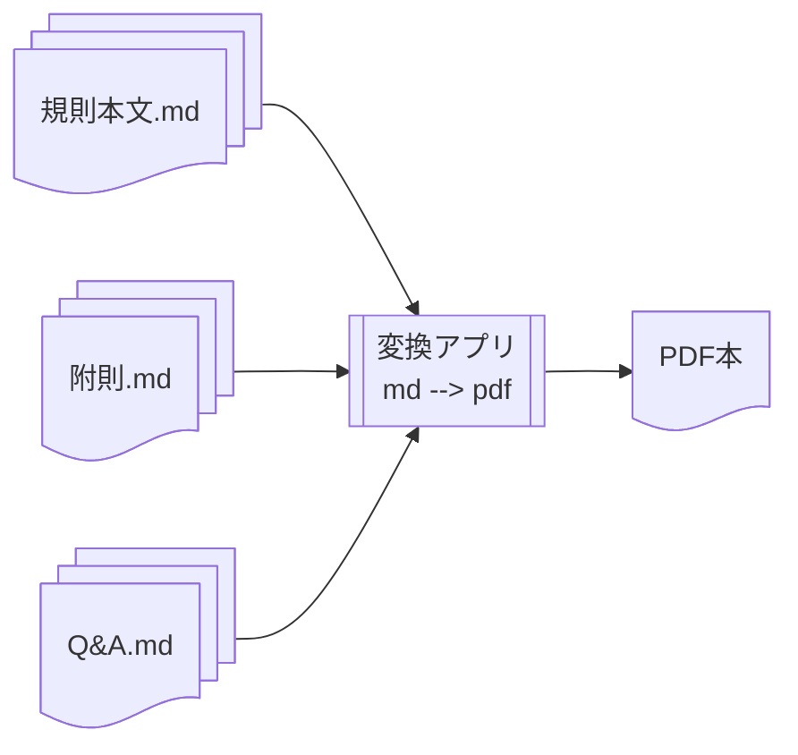

# 公式規則PDF本の作成

ここでは、以下の3つに分かれている公式規則(邦訳版)を元に、
一冊のPDF本を作成します:

1. [規則本文](../rules/)
1. [附則](../appendix/)
1. [Q&A](../qas/)



## 変換アプリ

マークダウンファイルからPDF本を作成するための変換アプリとして、
[Pandoc](https://ja.wikipedia.org/wiki/Pandoc)を利用しました。

### 準備

#### リポジトリの取得

```sh
git clone https://github.com/jpdga-shizuoka/rules.git
```

#### Docker環境の構築

Pandocの実行環境を容易に構築するため、
[Docker](https://www.docker.com)による仮想環境を作りました。
先ずは以下の手順で、Dockerの実行環境を用意します:

1. [Dockerのインストール](https://docs.docker.com/engine/install/)。
1. 実行用dockerイメージを作成する。

    ```sh
    cd pandoc
    docker pull pandoc/latex:latest-ubuntu
    docker build -t ordg .
    ```

    > 補足: イメージベースとして`latest-ubuntu`タグを指定しているのは、
    arm64版を使いたいため(だけ)です。
    その制約がなければ`latest`タグでも良いですが、
    その際は多少`Dockerfile`を書き換える必要があります。

### 実行

ホストOS上で `makedoc` を実行し、PDFを作成します。

```sh
cd pandoc
./makedoc [all|clean]
```

## 版の更新

公式規則が更新され新しいPDF本を作成する際は、以下を適宜変更します:

* [config/body.yaml](config/body.yaml): メタデータを書き換え
* [sources/preface.md](sources/preface.md): 序文の書き換え

### デバッグ

* ターゲットOS上でシェルを立ち上げるためには、`debug`コマンドを使います。
なお、PandocのカスタムフィルターにPythonを利用している関係で、
一度`/home/venv/bin/activate`を読み込んで、Pythonの実行環境を設定します。

    ```sh
    host$ cd pandoc
    host$ ./debug
    target% source /home/venv/bin/activate # Python実行環境の設定
    target% make [all|clean] 等
    ```

# 参照

* [Pandoc User's Guide](https://pandoc.org/MANUAL.html)
* [Panflute User's Guide](https://scorreia.com/software/panflute/guide.html) - Pandocフィルター用Pythonライブラリ
* [pandoc/latex](https://hub.docker.com/r/pandoc/latex) - Docker用Pandoc公式イメージ
